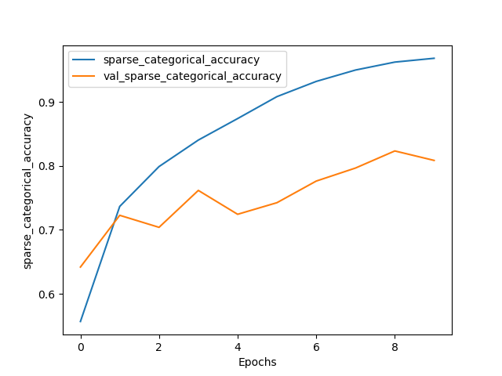
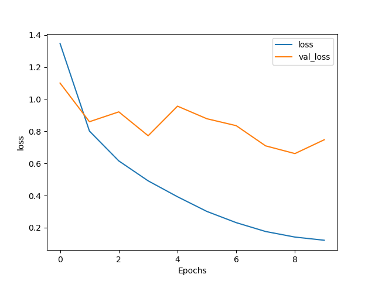

# 线性方法

## Logistic Regression

首先对数据进行预处理，包括归一化和降维等：

```python
(x_train, y_train), (x_test, y_test) = cifar10.load_data()
x_train, x_test = x_train / 255, x_test / 255

X = x_train.reshape(50000, 3 * 32 * 32)
Xt = x_test.reshape(10000, 3 * 32 * 32)
y = y_train.flatten()
yt = y_test.flatten()

logger.info('Start PCA')
pca = PCA(n_components=0.95)
X = pca.fit_transform(X)
Xt = pca.transform(Xt)
```


接下来选择求解器，`sklearn.svm.LogisticRegression`的solver决定了求解LR问题所使用的方法，我这里选择了平均梯度下降法sag：

```python
lr = LogisticRegression(solver='sag', random_state=4, verbose=1)
lr.fit(X, y)
```

得到运行结果如下：


在27次迭代后模型收敛，准确度大约在40%左右


# 非线性方法

## Kernel SVM

sklearn中，`sklearn.svm.SVC`有三个比较重要的参数，C、gamma、kernel。为了选择合适的参数，这里使用了`GridSearchCV`函数，自主选择合适的参数：

```python
param_grid = dict(
    gamma=[1e-3, 1e-2, 0.1, 1, 10, 100],
    C=[1, 1.5, 2, 3, 5],
    kernel=['rbf', 'linear', 'sigmoid']
)
model = SVC(decision_function_shape='ovo', verbose=1)

grid_search = GridSearchCV(model, param_grid)
grid_search.fit(X[:10000], y[:10000])
```

同时，这里为了尽快完成训练，只采用了前10000个数据用于训练。


不过实际运行时，还是会由于cifar10的样本特征太多，导致收敛速度太慢，因此对于样本增加了降维处理：

```python
(x_train, y_train), (x_test, y_test) = cifar10.load_data()
x_train, x_test = x_train / 255, x_test / 255

X = x_train.reshape(50000, 3 * 32 * 32)
Xt = x_test.reshape(10000, 3 * 32 * 32)
y = y_train.flatten()
yt = y_test.flatten()

logger.info('Start PCA')

pca = PCA(n_components=0.95)
X = pca.fit_transform(X)
Xt = pca.transform(Xt)

logger.info('Start choose parameters')
```


经过测试，C取1.5、gamma取0.01，采用高斯核能够得到较好的训练结果：


接下来，使用选取的参数进行训练：

```python
logger.info(f'start training the model with C={C}, gamma={gamma}, kernel={kernel}')
clf = SVC(C=C, gamma=gamma, kernel=kernel, decision_function_shape='ovo', verbose=11)
clf.fit(X, y)
logger.info('training finished')

y_pred_train = clf.predict(X)
y_pred_test = clf.predict(Xt)

train_accuracy = accuracy_score(y, y_pred_train)
test_accuracy = accuracy_score(yt, y_pred_test)

logger.info(f'训练集准确度: {train_accuracy}')
logger.info(f'测试集准确度: {test_accuracy}')
```


训练结果如下：


# 神经网络

## ResNet

这里选择了resnet作为网络结构，使用tensorflow框架实现，resnet的核心结构定义如下：

```python
class ResnetBlock(Model):

    def __init__(self, filters, strides=1, residual_path=False):
        super(ResnetBlock, self).__init__()
        self.filters = filters
        self.strides = strides
        self.residual_path = residual_path

        self.c1 = Conv2D(filters, (3, 3), strides=strides, padding='same', use_bias=False)
        self.b1 = BatchNormalization()
        self.a1 = Activation('relu')

        self.c2 = Conv2D(filters, (3, 3), strides=1, padding='same', use_bias=False)
        self.b2 = BatchNormalization()

        if residual_path:
            self.down_c1 = Conv2D(filters, (1, 1), strides=strides, padding='same', use_bias=False)
            self.down_b1 = BatchNormalization()

        self.a2 = Activation('relu')

    def call(self, inputs, **kwargs):
        residual = inputs

        x = self.c1(inputs)
        x = self.b1(x)
        x = self.a1(x)

        x = self.c2(x)
        y = self.b2(x)

        if self.residual_path:
            residual = self.down_c1(inputs)
            residual = self.down_b1(residual)

        out = self.a2(y + residual)
        return out
```

简单而言，residual_path代表是否存在残差路径，若存在，则需要将输入的数据过一层1*1的卷积核，使得它可以与$f(x)$相加

本作业中实现了resnet18，具体网络定义如下：

```python
class ResNet18(Model):
    def __init__(self, block_list, initial_filters=64):
        super(ResNet18, self).__init__()

        self.num_blocks = len(block_list)
        self.block_list = block_list
        self.out_filters = initial_filters
        self.c1 = Conv2D(self.out_filters, (3, 3), strides=1, padding='same', use_bias=False)
        self.b1 = BatchNormalization()
        self.a1 = Activation('relu')
        self.blocks = tf.keras.models.Sequential()

        for block_id in range(len(block_list)):
            for layer_id in range(block_list[block_id]):
                if block_id != 0 and layer_id == 0:
                    block = ResnetBlock(self.out_filters, strides=2, residual_path=True)
                else:
                    block = ResnetBlock(self.out_filters, residual_path=False)
                self.blocks.add(block)
            self.out_filters *= 2
        self.p1 = GlobalAveragePooling2D()
        self.f1 = Dense(10, activation='softmax', kernel_regularizer=tf.keras.regularizers.l2())

    def call(self, inputs, **kwargs):
        x = self.c1(inputs)
        x = self.b1(x)
        x = self.a1(x)
        x = self.blocks(x)
        x = self.p1(x)
        y = self.f1(x)
        return y
```

在10个epoch之后，训练结果如下所示：


通过以下代码绘制出ACC和LOSS曲线：

```python
def plot(_history, string, save_path=None):
    plt.plot(_history.history[string])
    plt.plot(_history.history['val_' + string])
    plt.xlabel('Epochs')
    plt.ylabel(string)
    plt.legend([string, 'val_' + string])
    plt.savefig(save_path)
    plt.show()
```





